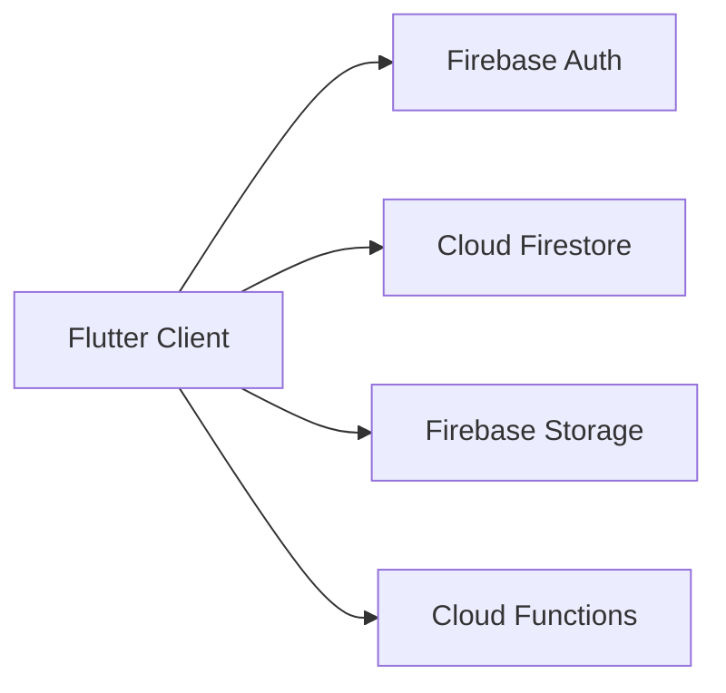

# Football App

Football App is a Flutter and Firebase application for team management, match workflows, community interaction, and football-related commerce. The project combines mobile-style product features such as authentication, chat, feedback, and shop flows with operational features like fixtures, statistics, and team administration.

## Project Scope

- Authentication and user profile management
- Team creation, browsing, and roster-related workflows
- Match scheduling, score updates, and statistics tracking
- Real-time chat between users
- Shop, cart, and order-related flows
- Feedback submission, moderation, and dashboard-style review

## Architecture



The architecture diagram is justified here because the project spans multiple client platforms and several Firebase services rather than a single local application.

## Stack

- Flutter and Dart
- Firebase Auth, Firestore, Storage, and Cloud Functions
- Provider and AppState
- go_router
- fl_chart
- FlutterFlow

## Technical Highlights

- Multi-platform Flutter client targeting Android, iOS, and web
- Firebase-backed real-time and media-oriented application flows
- Broad feature surface across team management, match operations, chat, commerce, and feedback
- FlutterFlow-generated structure combined with application-specific modules under `lib/`

## Repository Layout

```text
lib/
  auth/           authentication logic and providers
  backend/        Firebase schema, helpers, and API-facing code
  cart/           cart and order flows
  chat/           messaging screens and logic
  components/     reusable UI components
  feedback/       feedback flows and statistics
  flutter_flow/   generated utilities and theme assets
  game/           match creation, details, stats, and calendar flows
  shop/           product and admin shop features
  team/           team creation, editing, and listing
  user/           login, registration, and profile screens
firebase/         backend-side Firebase project assets
```

## Getting Started

### Prerequisites

- Flutter SDK
- Firebase project configuration
- Android Studio or Xcode for device emulation when needed

### Setup

```bash
flutter pub get
flutter run
```

Place platform-specific Firebase configuration files in the expected Android and iOS locations before running the app.

## Notes

- This repository is marked as a private project in its current documentation
- The README is strongest when it frames the app as a Firebase-backed product prototype rather than a low-level systems project
